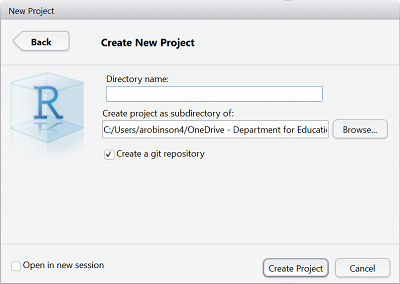

```{r setup, include=FALSE}
knitr::opts_chunk$set(echo = FALSE)
```

## Introduction

This presentations aims to cover how you can undertake analytical projects using R such that they are **maintanable** and **reproducible**.

The presentation will cover:

- Getting started with R Projects
- Project Structure
- Modulating code and functions
- Version Control
- Dependency Management
- R Markdown

## R Projects

Code such as the following makes your code instantly difficult to reproduce:

```r
read_csv("C:/Users/arobinson4/Documents/data.csv"")
```

or 

```r
setwd("C:/Users/arobinson4/Documents")
```

Somebody picking up your work will have to change references to their drive or may not even have access to the required drive in order to get the code to run. 

To ensure that this never happens you should be using **[R Projects](https://support.rstudio.com/hc/en-us/articles/200526207-Using-Projects)**. To create a new project got to File > New Project. 

These do the following:

- Create 1 folder where all of your projects analysis is stored.
- Makes the working directory of R that folder when the .Rproj file is opened.

For another analyst to pick up your work they simply open the .Rproj file which opens the project environment in R Studio.

## Project Structure

After creating a project for all of your files it is useful to create sub folders to group together different types of files.

An example minimal structure is as follows:

- R - R Scripts
- Data - Local Copies of data
- Queries - Queries to get data
- Outputs - Project outputs
  
To refer to files in these folders you can then simply do the following:

```r
read_csv("Data/dataset.csv"")
```

Using a common convention will mean that anyone in your team will quickly be able to identify where files easily inspect them. 

On top of this it is useful to include a **README.md** that covers what your project is trying to achieve, any assumptions you have made and notes on the data sources. 

## Modulating code and functions

Long R Scripts that contain all of the code required to run your analysis are not a good idea and are usually not necessary.

Even if it is well commented there comes a point when getting your head around what is going on is almost impossible and checking for errors becomes increasingly difficult. 

If you are writing long R Scripts you should ask yourself the following questions:

1. Am I writing too much code for what I am trying to do?
2. Could i break this down into multiple scripts?

## Modulating code and functions

### Am I writing too much code for what I am trying to do?

In comparison to Excel or SQL where reducing repetition can be difficult, R makes doing so relatively easy to do.

**Example**

Say you need to create 6 charts based on different cuts of a dataset. You may be tempted to write the code out each time and manually change the parameter.

```r
ggplot(Data = dataset_1, aes(x=x_col, y = y_col)) +
  geom_point()
.
.
ggplot(Data = dataset_6, aes(x=x_col, y = y_col)) +
  geom_point()
```

This will become a burden when the number of parameters increase or changes to the code are required.

## Modulating code and functions

A more succinct approach to this would be to create a function that makes the chart with the dataset as a parameter.

e.g. 

```r

fn_chart <- function(dataset){
ggplot(Data = dataset, aes(x=x_col, y = y_col)) +
  geom_point()
}

```

We could apply this to all of the data sets in multiple ways. One example with lapply is as follows:

```r
# Create a list of all the datasets

datasets <- list(dataset_1,dataset_2,dataset_3,dataset_4,dataset_5,dataset_6)

lapply(datasets, fn_chart)

```

## Modulating code and functions

### Could i break this down into multiple scripts?

Say you are working with 3 data sets that need to undergo a data wrangling stage before being joined together as the dataset ready for analysis. 

You could do all of this in one script but often this step is the same if not longer than the analysis itself. Breaking this out of the main script allows yourself and others to better understand what is going on. 

A potential way to structure the R folder is as follows:

- main.R
- dataset_1.R
- ..
- dataset_3.R

in the main.R script you can the do the following to load the scripts:

```r
source("R/dataset_1.R"")
```

## Version Control 

Version control allows you to comprehensively manage files and changes to files in code based projects. Git is the defacto version control system. 

At a minimum it allows you to keep a history of all your saves (commits) and gives you the ability to easily compare differences and revert back if required.


## Version Control 

To use git you need to download and install from [here](https://git-scm.com). Git is a command line tool but there are multiple GUIs that can let you use git in a visual way. 

Once you have installed git you will have the option to put your projects under git source control via R Studio as follows.



This will then give you a new icon for Git in R Studio where you can undertake the majority of Git commands in the IDE.

## Version Control 

### Committing

Probably the main function of Git that you will need to use is the [Commit](https://git-scm.com/docs/git-commit). A commit is basically a save point that you will be able to go back to at any point. 

To make a commit in R Studio go to the GIT drop down and select commit. You will then get a pop up where you can pick the files you want to commit and type a message to link to the commit.

### Pushing and Pulling

Pushing and Pulling come into the equation when you are working with a [remote](https://git-scm.com/book/en/v2/Git-Basics-Working-with-Remotes). A remote is simply a central repository separate to your computer. They are useful for collaboration. 

[GitHub](https://github.com/) is arguably the most popular git remote platform but is not always appropriate for internal work. Other options include a git remote on a shared drive or [Visual Studio Online](https://www.visualstudio.com/vso/). 

When undertaking collaborative work with services like GitHub you should read up on [branching](https://git-scm.com/book/en/v2/Git-Branching-Branches-in-a-Nutshell) and [pull requests](https://yangsu.github.io/pull-request-tutorial/). These allow you to create branches separate to the main project and ask for a code review to be undertaken before they can be merged into master. 

## Dependency Management

Dependency management is to do with the versions of packages that you or others have installed on your machines when trying to run project code. 

It comes in two parts

- **Future versions of packaages** - Because R Packages are constantly evolving it is perfectly possible that future versions of packages that you rely on in your analysis have changed functionality. 

- **Different versions for different users** - Other users or collaborators may have different package versions installed to you. They may need to update their base packages which in turn may break some of their other projects. 

A solution to this problem is **[Packrat](https://rstudio.github.io/packrat/)**. Packrat is a dependency management packages that installs all required packages for a project in to the project folder itself. 

This means that whenever anyone picks up the project they can automatically use the exact packages used at development time.

Packrat is installed as per any other package and the documentation outlines how to use it.

## R Markdown

R Markdown allows you to complete the end to end aspect of your analysis in R by allowing you to write your output using a mix of [Markdown](https://github.com/adam-p/markdown-here/wiki/Markdown-Cheatsheet) is a relatively simple mark up language and R code chunks.

You can easily generate outputs in HTML, Word or PDF Format. 

Benefits include:

- If changes are made to underlying calculation you can simply re-run the code to update all of the figures
- No need to copy and paste values.
- Makes QA easier
- They can be source controlled and differences between versions easily analysed.

## Where to go Next

This workflow is far from perfect but should give a good basis on getting up to speed with the core ideas that underpin working in R.

Next steps to consider after exploring these are as follows:

- **Adding Unit Testing to code** - when you create functions you want to know they work. Unit testing allows you to pass them dummy data and check that results are as expected.

- **R Packages** - The fundamental reproducible unit in R are Packages.

## Useful Resources

[R for Data Science](http://r4ds.had.co.nz/)

[Advanced R](http://adv-r.had.co.nz/)

[Bookdown](https://bookdown.org/)

[Pro Git](https://git-scm.com/book/en/v2)

[Packrat Documentation](https://rstudio.github.io/packrat/)

[Markdown Cheatsheet](https://github.com/adam-p/markdown-here/wiki/Markdown-Cheatsheet)

[ioslides Documentation](http://rmarkdown.rstudio.com/ioslides_presentation_format.html)


