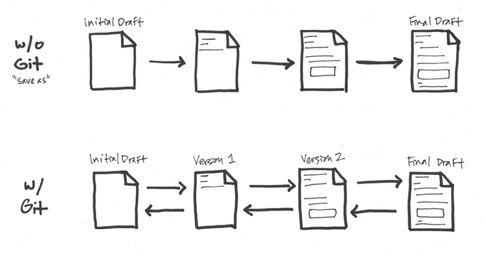

```{r setup, include=FALSE}
knitr::opts_chunk$set(echo = FALSE)
```

## Introduction

This presentations aims to cover how you can undertake analytical projects using R such that they are **maintanable** and **reproducible**.

The presentation will cover:

- Getting started with R Projects
- Project Structure
- Modulating code and functions
- Version Control
- Creating your outputs in R Markdown

## R Projects

Code such as the following makes your code instantly difficult to reproduce:

```r
read_csv("C:/Users/arobinson4/Documents/data.csv"")
```

or 

```r
setwd("C:/Users/arobinson4/Documents")
```

Somebody picking up your work will have to change references to their drive or may not even have access to the required drive in order to get the code to run. 

To ensure that this never happens you should be using **[R Projects](https://support.rstudio.com/hc/en-us/articles/200526207-Using-Projects)**. To create a new project got to File > New Project. 

These do the following:

- Create 1 folder where all of your projects analysis is stored.
- Makes the working directory of R that folder when the .Rproj file is opened.

For another analyst to pick up your work they simply open the .Rproj file which opens the project environment in R Studio.

## Project Structure

After creating a project for all of your files it is useful to create sub folders to group together different types of files.

An example minimal structure is as follows:

- R - R Scripts
- Data - Local Copies of data
- Queries - Queries to get data
- Outputs - Project outputs
  
To refer to files in these folders you can then simply do the following:

```r
read_csv(Data/dataset.csv)
```

Using a common convention will mean that anyone in your team will quickly be able to identify where files easily inspect them. 

On top of this it is useful to include a **README.md** that covers what your project is trying to achieve, any assumptions you have made and notes on the data sources. 

## Modulating code and functions

Long R Scripts that contain all of the code required to run your project are not a good idea and usually unneccesary. 

Even if it is well commented there comes a point when getting your head around what is going on is almost impossible and checking for errors becomes increasingly difficult. 

If you are writing long R Scripts you should ask yourself the following questions:

1. Am I writing too much code for what I am trying to do?
2. Could i break this down into multiple scripts?

## Modulating code and functions continued

### Am I writing too much code for what I am trying to do?

In comparrison to Excel or SQL where reducing repetition can be difficult, R makes doing so relatively easy to do.

**Example**

Say you need to create 6 charts based on different cuts of a dataset. You may be tempted to do write the code out each time and manually change the parameter.

```r
ggplot(Data = dataset_1, aes(x=x_col, y = y_col)) +
  geom_point()
.
.
ggplot(Data = dataset_6, aes(x=x_col, y = y_col)) +
  geom_point()
```

This is a burden in the following situations:

1. Lots of parameters changing
2. Changes to the code are required in future. 

## Modulating code and functions continued

A more succint approach to this would be to create a function that makes the chart with the dataset as a parameter.

e.g. 

```r

fn_chart <- function(dataset){
ggplot(Data = dataset, aes(x=x_col, y = y_col)) +
  geom_point()
}

```

We could apply this to all of the datasets in mutliple ways. One example with lapply is as follows:

```r
# Create a list of all the datasets

datasets <- list(dataset_1,dataset_2,dataset_3,dataset_4,dataset_5,dataset_6)

lapply(datasets, fn_chart)

```

## Modulating code and functions continued

### Could i break this down into multiple scripts?

Say you are working with 3 datasets that need to undergo a data wrangling stage before being joined together as the dataset ready for analysis. 

You could do all of this in one script but often this step is the same if not longer than the analysis itself. Breaking this out of the main script allows yourself and others to better understand what is going on. 

A potential way to structure the R folder is as follows:

- main.R
- dataset_1.R
- ..
- dataset_2.R

in the main.R script you can the do the following to load the scripts:

```r
source(R/dataset_1.R)
```

## Version Control 

Version control allows you to comprehensively manage files and changes to files in code based projects. Git is the defacto version control system. 

At a minimum it allows you to keep a history of all your saves (commits) and gives you the ability to easily compare differences and revert back if required.



## Version Control 

To use git you need to download and install from [here](https://git-scm.com).

At a minimum you can do the following:

- Check in changes to files routinely to provide the option to go back to the state of the scripts at these points. 

Further to this you can do the following:

- Create multiple branches that you can switch between to try out changes before adding them to the master version of the project. 

All of this can be done via the command line but once set up with Git you should also get a git GUI in R Studio that allows you to do all of this visually. You may need the command line for advanced functionality but should look up how to as and when required. 

## Dependency Management

When programming in R you will undoubtedly use packages. Packages generally are downloaded from CRAN but can also be installed from other sources (e.g. GitHub). 

Packages are constantly evolving and you may get in to the following situation:

1. Your code ran perfectly when you created it but no longer runs at a later date where you have made updates to your packages.

2. Your code runs on your machine but not on another persons who has different packages to you. 

3. You need to manually check through a project you pick up and install all packages you don't have. Still you may get problems with the versions you install. 

A solution to this problem is **Packrat**. Packrat is a dependency management packages that installs all required packages for a project in to the project folder itself. 

This means that whenever anyone picks up the project they can automatically use the exact packages used at development time.

## R Markdown

R Markdown allows you to 

When writing R Markdown documents you should avoid writing much doe in the markdown itself. Within the markdown script you can simply use the source function to run external files and then reference the variable you want to output either in line or via a code chunk.

## Where to go Next

This workflow is far from perfect but should give a good basis on getting up to speed with the core ideas that underpin working in R.

Next steps to consider after exploring these are as follows:

- **Adding Unit Testing to code** - when you create functions you want to know they work. Unit testing allows you to pass them dummy data and check that results are as expected.

- **R Packages** - The fundamental reproducible unit in R are Packages.

## Useful Resources

[Markdown Cheatsheet](https://github.com/adam-p/markdown-here/wiki/Markdown-Cheatsheet)


